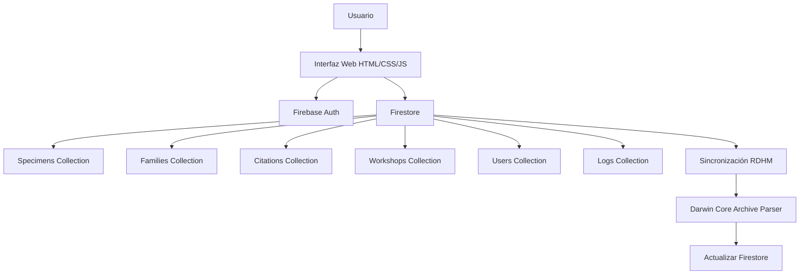

# Arquitectura del Sistema

```mermaid
graph TD
    A[Usuario] --> B[Interfaz Web HTML/CSS/JS]
    B --> C[Firebase Auth]
    B --> D[Firestore]
    D --> E[Specimens Collection]
    D --> F[Families Collection]
    D --> G[Citations Collection]
    D --> H[Workshops Collection]
    D --> I[Users Collection]
    D --> J[Logs Collection]
    D --> K[Sincronización RDHM]
    K --> L[Darwin Core Archive Parser]
    L --> M[Actualizar Firestore]
```