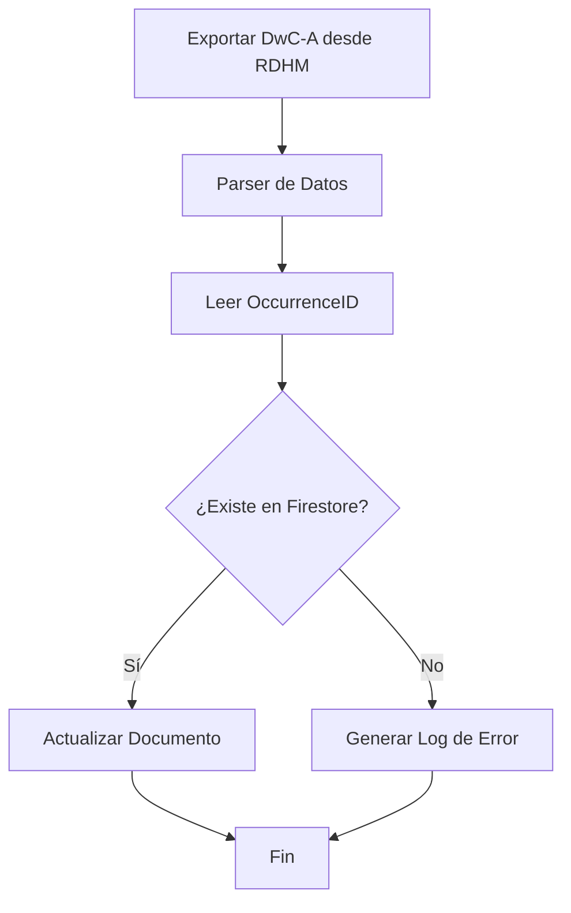

# Diagrama de Flujo de Sincronización

```mermaid
flowchart TD
    A[Exportar DwC-A desde RDHM] --> B[Parser de Datos]
    B --> C[Leer OccurrenceID]
    C --> D{¿Existe en Firestore?}
    D -->|Sí| E[Actualizar Documento]
    D -->|No| F[Generar Log de Error]
    E --> G[Fin]
    F --> G
```